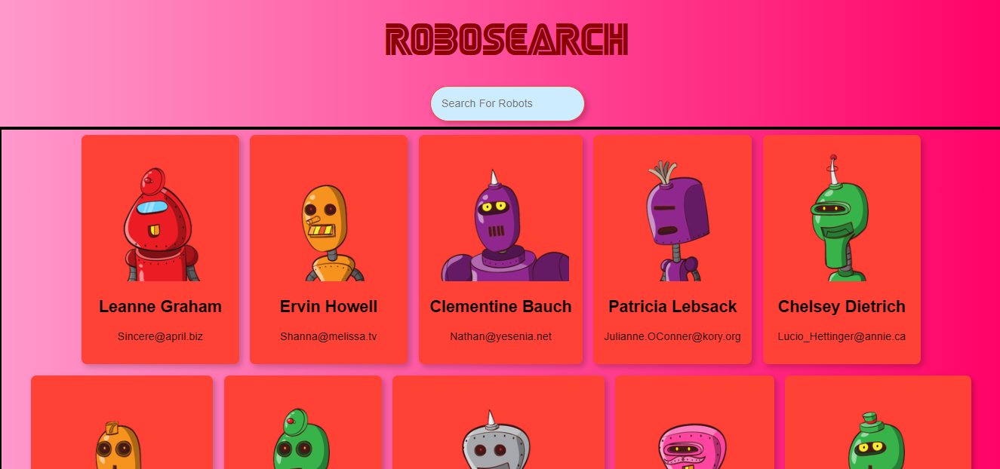

# robosearch

The project is a React application called "Robosearch". This application displays a list of robots and allows users to search for robots based on their names. It is developed as a demonstration of using React.

Features
Displays a list of robots from an external API.
Includes a search feature to filter robots based on name.
Dynamically updates the robot list based on the search input.
Utilizes Card and Scroll components for a clean and responsive UI.

Installation
Clone this repository to your local directory.
Run the command npm install to install all dependencies.
Run the command npm start to run the application locally.
Open your browser and access http://localhost:3000 to view the application.

Technologies Used
React: JavaScript library for building user interfaces.
Tachyons: CSS toolkit for fast and responsive styling.
JSONPlaceholder API: Fake data source for obtaining the robot list.
Description and Proficiency
This project showcases your ability to use React to build a responsive and interactive frontend application. Through this project, you have demonstrated proficiency in:

React component structure and usage.
Working with state and props in React.
Fetching and displaying data from an external API.
Implementing a search feature with data filtering.
Applying styling using CSS toolkit like Tachyons.